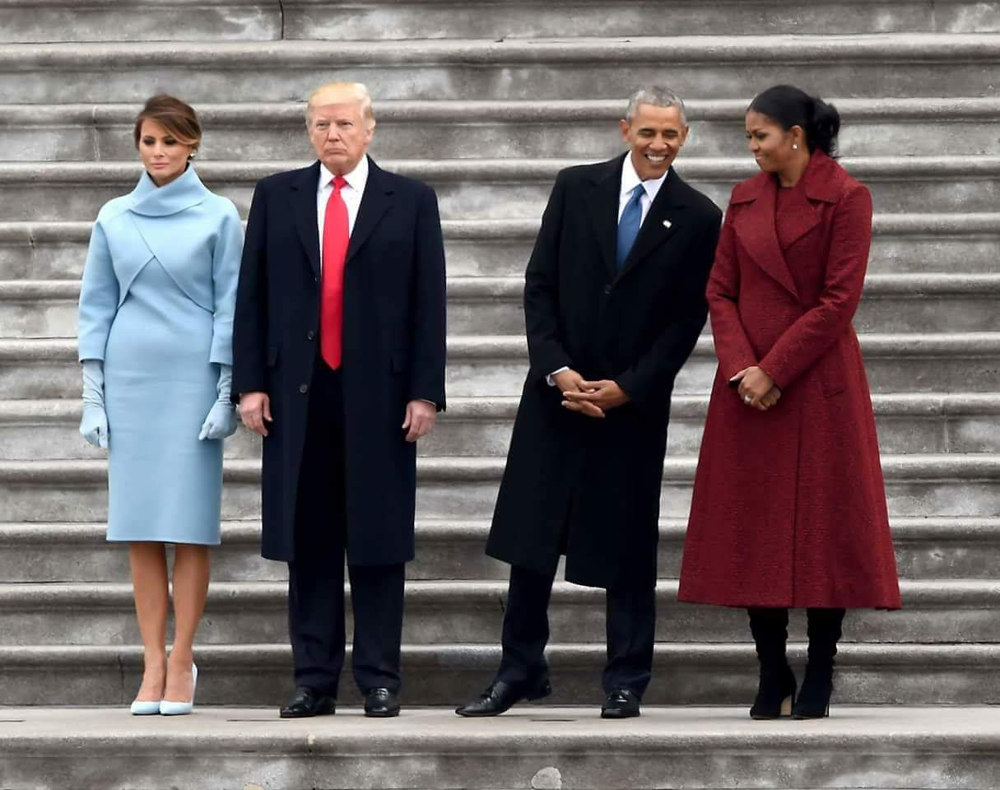

<!--Set environment and load pre-processed docs-->
```{r echo=FALSE, message=FALSE, warning=FALSE}
library(tm)
library(dplyr)

load('../output/stemDocs.RData')
load('../output/sentenceList.RData')
load('../output/speechList.RData')

unemplyGDP <- tbl_df(read.csv('../output/uneplyGDP.csv'))
unemplyGDP$Date <- as.Date(unemplyGDP$Date)

folder.path <- "../data/fulltext/"
filenames <- list.files(path = folder.path, pattern = "*.txt")
dtm <- DocumentTermMatrix(docs,control = list(weighting = function(x)
                                             weightTfIdf(x,normalize =FALSE),stopwords = TRUE))

word_freq <- read.csv('../output/word_freq.csv')
word_freq <- tbl_df(word_freq)
colnames(word_freq) <- c("word","freq")

```
# Introduction
It is said that people are what they eat, but maybe not what they say. Even US presidents make promise never implemented, or exaggerate their achievements. </br>
However, we still believe there are something information, about the speeker himself, his party, or the historical environment behind him, could be retreived.</br>
In this article, we basically asked 3 questions, </br>
<li>How does Republican focus differently from Democratic,</li>
<li>How does words-choosing reflect national economic environment, and</li>
<li>How does presidents' moods change at farewell compared to inauguration.</li>
Crude answers are, Republicans call for jobs while Democrats call for money, a nominee's speech is more practical then a president, while a newly-elected president is happier than a nominee.</br>
Now let me navigate you through the data, clarify assumptions, and see how we end up there.


# How does Republican focus differently from Democratic
## A baseline
To set up a baseline, I simply calculated the word frequency and see there are some popular words among all the presidents, like "American", "people" and "nation". Here we already smell the style of presidential speech.
```{r echo=FALSE}
library(ggplot2)
p <- ggplot(subset(word_freq,freq>765),aes(word,freq))
p <- p + geom_bar(stat = "identity") +
  ggtitle("US Presidents's favourite Words")
p <- p + theme(axis.text.x = element_text(angle = 45,hjust = 1))
p
```

## With Trump

Since we focus on comparison between Republican and Democratic, a few speeches associated with Federalist or Whig are omitted. We group these documents into two corpus. Our basic assumotions are, if a word appears many times in a specific document, then it features that document, but if this word also appears many times in most documents, then it is more likely a general word, and hence we shrink it's importance to that specific document. And then we simply use mean importance as the word's weight to a group.
```{r echo=FALSE, warning=FALSE, message=FALSE}
library(wordcloud)
library(RColorBrewer)
library(tidytext)
set.seed(59)
repb_terms <- tidy(colMeans(tbl_df(as.matrix(dtm))[speech.list$Party=='Republican',]%>%na.omit()))
demc_terms <- tidy(colMeans(tbl_df(as.matrix(dtm))[speech.list$Party=='Democratic',]%>%na.omit()))

par(mfrow=c(1,2), mar = c(0, 0, 3, 0))
        wordcloud(repb_terms$names, 
                  repb_terms$x,
              scale=c(4,0.5),
              max.words=50,
              min.freq=1,
              random.order=FALSE,
              rot.per=0,
              use.r.layout=FALSE,
              random.color=FALSE,
              colors=brewer.pal(9,"Reds"))
        wordcloud(demc_terms$names, 
                  demc_terms$x,
              scale=c(4,0.5),
              max.words=50,
              min.freq=1,
              random.order=FALSE,
              rot.per=0,
              use.r.layout=FALSE,
              random.color=FALSE,
              colors=brewer.pal(9,"Blues"))
```

## Without Trump
Clearly presidents from both parties talk a lot about America, and we already see some differences between these two groups. Worker, immigrant and illegal in red, revenue, tariff and trade in blue. I just notice that there are some specific names in red, like Hillary, Obama and Trump, and somehow I suspect Trump contributes a lot in that. So I leave out Trump for the time being and see what happens.
```{r echo=FALSE}

set.seed(59)
repb_terms_noTrump <- tidy(colMeans(tbl_df(as.matrix(dtm))[(speech.list$Party=='Republican')&(speech.list$File!="DonaldJTrump"),]%>%na.omit()))

par(mfrow=c(1,2), mar = c(0, 0, 3, 0))
        wordcloud(repb_terms_noTrump$names, 
                  repb_terms_noTrump$x,
              scale=c(4,0.5),
              max.words=50,
              min.freq=1,
              random.order=FALSE,
              rot.per=0,
              use.r.layout=FALSE,
              random.color=FALSE,
              colors=brewer.pal(9,"Reds"))
        wordcloud(demc_terms$names, 
                  demc_terms$x,
              scale=c(4,0.5),
              max.words=50,
              min.freq=1,
              random.order=FALSE,
              rot.per=0,
              use.r.layout=FALSE,
              random.color=FALSE,
              colors=brewer.pal(9,"Blues"))
```
</br>
Boom! Those names go away with Trump, and some new words like children and freedom come in. You would have to admit that Trump has a significant influence on the word map for the whole party, his absence almost reshapes the landscape.</br>

## A contrast.
To make the comparison even sharper, I literally calculated the difference between those words weights, and let's see which words are drawn higher attention from which party.
```{r echo=FALSE}
set.seed(49)
repb <- colMeans(tbl_df(as.matrix(dtm))[(speech.list$Party=='Republican'),]%>%na.omit())
demc <- colMeans(tbl_df(as.matrix(dtm))[(speech.list$Party=='Democratic'),]%>%na.omit())
repb_careMore <- tidy(repb-demc+10)
demc_careMore <- tidy(demc-repb+10)
par(mfrow=c(1,2), mar = c(0, 0, 3, 0))
        wordcloud(repb_careMore$names, 
                  repb_careMore$x,
              scale=c(4,0.5),
              max.words=50,
              min.freq=1,
              random.order=FALSE,
              rot.per=0,
              use.r.layout=FALSE,
              random.color=FALSE,
              colors=brewer.pal(9,"Reds"))
        wordcloud(demc_careMore$names, 
                  demc_careMore$x,
              scale=c(4,0.5),
              max.words=50,
              min.freq=1,
              random.order=FALSE,
              rot.per=0,
              use.r.layout=FALSE,
              random.color=FALSE,
              colors=brewer.pal(9,"Blues"))
```
On last pair of pictures we see "job" appears on both sides, but here it becomes clear that Republicans address even more on jobs then Democrats, it is one of the deepest red word except for those names(again, Trump really dominates the impression of his party). On the other hand, revenue and tariff are two of the deepest blue words. If we are bold enough we would draw the conclusion that Republicans emphasize more on jobs while Democrats emphasize more on money.Let's make a quick check.</br>
Presidents who mentioned tariff most are,
```{r echo=FALSE}
speech.list$President[order(as.matrix(dtm[,'tariff']),decreasing = TRUE)[1:5]]
```
4 of first 5 are Democrats, and Presidents who mentioned job most are,
```{r echo=FALSE}
speech.list$President[order(as.matrix(dtm[,'job']),decreasing = TRUE)[1:5]]
```
3 of first 5 are Republicans.

# How does words-choosing reflect national economic environment
Now let's introduce some other data to make things more interesting.</br>
I assume that presidents base their speeches on some realities, maybe they promise a lot about jobs in the nomination when unemployment is high, or brag more about jobs they have created at farewell when GDP growth does become higher. Or they just follow what they believe to be important and never take a look at the economy index the night before an address. </br>
It is mysterious how they knit realities into their speeches and at what situation. Hence I downloaded GDP growth percentage per quarter and unemployment per month data from <a href="https://www.bls.gov/">U.S. Bureau of Labor Statistics</a>, compare them to the word frequency of nearest following address. </br>
We focus on speeches after 1952 since from then reliable unemployment and GDP statistics become available.
```{r message=FALSE, echo=FALSE}
library(scales)

speech.list$Job <- as.matrix(dtm[,'job'])
speech.list$Economy <- as.matrix(dtm[,'econom'])
speech.list$Date <- as.Date(speech.list$Date,"%Y-%m-%d")

word.reflect <- speech.list%>%filter((Date>as.Date("1952-1-1"))&(Date<as.Date("2017-1-1")))%>%select(Date,Job,Economy)%>%inner_join(unemplyGDP)
p <- ggplot() + 
  geom_line(data = word.reflect%>%select(Date,Job), aes(x = Date, y = Job, color = "Job")) +
  geom_line(data = word.reflect%>%select(Date,Economy), aes(x = Date, y = Economy, color = "Economy")) +
  geom_line(data = word.reflect%>%select(Date,Unemployment), aes(x = Date, y = Unemployment, color = "Unemployment")) +
  geom_line(data = word.reflect%>%select(Date,GDPperc), aes(x = Date, y = GDPperc, color = "GDPgrowth")) +
  ggtitle("Trends for Word Frequencies and Economic Indexes") +
  xlab('') +
  ylab('Temporal Trends')
p
```
</br>
From above plot it's kind of hard to identify the association between each pairs, so I divided GDP growth series into "Higher GDP growth" half and "Lower GDP growth" half, the same operation on unemployment, and make them factors.</br>
Now we can compare word frequencies of "job" and "economy" in different levels of GDP growth or unemployment, we use ANOVA test for unequal sizes to test whether higher and lower groups of an economic index have equal mean for a specific word. For example, if there is no association between GDP growth and frequency "job" is mentioned, then we expect in the below figure red and blue proportion roughly the same in "job" column.</br>
I did exploration with different type of speeches, and only for inaugural speeches there is a significant difference(see second table), so I plot only this one. </br>
So if one has to choose a night before his speech to go through the economic index, it would the night before nomination speech. And if last quarter's GDP growth is high, he would talk a lot about jobs.</br>
Why would nomination speeches be so different from inauguration and farewell? I can't say for sure at this moment, but notice that nomination happens in summer while the other two happens in winter/early spring, there might be some seasonal association attached to it.
```{r message=FALSE, echo=FALSE}
word.reflect <- speech.list%>%filter((Date>as.Date("1952-1-1"))&(Date<as.Date("2017-1-1"))&(type=="nomin"))%>%select(Date,Job,Economy)%>%inner_join(unemplyGDP)
word.reflect$higherUnemployment <- as.factor(word.reflect$Unemployment>median(word.reflect$Unemployment))
word.reflect$higherGDP <- as.factor(word.reflect$GDPperc>median(word.reflect$GDPperc))
#how GDP influent word frequency
GDP.influence <- word.reflect%>%select(Job,Economy,higherGDP,higherUnemployment)%>%group_by(higherGDP)%>%summarise(meanJobFreq=mean(Job),meanEconomyFreq=mean(Economy))
#GDP.influence
GDP.influence <- as.data.frame(list(higherGDP=c(FALSE,FALSE,TRUE,TRUE),Freq=c(0.99,1.46,5.89,2.71),Word=c('Job','Economy','Job','Economy')))
ggplot(GDP.influence, aes(Word, Freq, fill = higherGDP )) +
  geom_bar(position = "fill",stat = "identity") +
  ggtitle("Word Frequency v.s. GDP growth rate with Inaugural Speeches")
unemployment.influence <- word.reflect%>%select(Job,Economy,higherGDP,higherUnemployment)%>%group_by(higherUnemployment)%>%summarise(meanJobFreq=mean(Job),meanEconomyFreq=mean(Economy))
#unemployment.influence
p_table <- as.data.frame(list(
                    unemployment=c(pairwise.t.test(word.reflect$Job,word.reflect$higherUnemployment,pool.sd = TRUE,p.adjust.method = "bonf")$p.value,
                    pairwise.t.test(word.reflect$Economy,word.reflect$higherUnemployment,pool.sd = TRUE,p.adjust.method = "bonf")$p.value),
                    GDPgrowth=c(pairwise.t.test(word.reflect$Job,word.reflect$higherGDP,pool.sd = TRUE,p.adjust.method = "bonf")$p.value,
                    pairwise.t.test(word.reflect$Economy,word.reflect$higherGDP,pool.sd = TRUE,p.adjust.method = "bonf")$p.value)))
rownames(p_table) <- c('job','economy')
#print("p value for sample mean:")
p_table
```
Okay, so except that within nomination speeches there is association between how likely a nominee refers to "job" and the GDP growth rate, presidents not very much choose their words according to recent economic statistics. But would their moods be effected by it? Say, would they be more positive when unemployment drops? </br>
Unfortunately, I tested this hypothesis and found no significant evidence, so I omitted this part. But don't be disappointed! It turns out there is something significant in terms of what influence a president's mood. Guess what?

<!-- # ```{r} -->
<!-- # sentiment.reflect <- sentence.list%>%filter(type=='nomin')%>%group_by(Date)%>%summarise(positive=mean(positive))%>%na.omit()%>%inner_join(unemplyGDP) -->
<!-- # #sentence.list%>%group_by(Date)%>%summarise(positive=mean(positive))%>%na.omit()%>%inner_join(unemplyGDP) -->
<!-- # sentiment.reflect$higherGDP <- as.factor(sentiment.reflect$GDPperc>median(sentiment.reflect$GDPperc)) -->
<!-- # sentiment.reflect$higherUnemployment <- as.factor(sentiment.reflect$Unemployment>median(sentiment.reflect$Unemployment)) -->
<!-- #  -->
<!-- # GDP.influence <- sentiment.reflect%>%select(positive,higherGDP,higherUnemployment)%>%group_by(higherGDP)%>%summarise(meanPositive=mean(positive)) -->
<!-- # unemployment.influence <- sentiment.reflect%>%select(positive,higherGDP,higherUnemployment)%>%group_by(higherUnemployment)%>%summarise(meanPositive=mean(positive)) -->
<!-- #  -->
<!-- # p_table <- as.data.frame(list( -->
<!-- #                     unemployment=pairwise.t.test(sentiment.reflect$positive,sentiment.reflect$higherUnemployment,pool.sd = TRUE,p.adjust.method = "bonf")$p.value, -->
<!-- #                     GDPgrowth=pairwise.t.test(sentiment.reflect$positive,sentiment.reflect$higherGDP,pool.sd = TRUE,p.adjust.method = "bonf")$p.value)) -->
<!-- # rownames(p_table) <- 'postive' -->
<!-- # p_table -->
<!-- # ``` -->


# How does presidents' moods change at farewell compared to inauguration

</br>

Well, I used mean positive sentiment level as a metric and compare different types of speeches. And actually I got very small p-values(see last table) that the difference among those groups is unlikely due to random sampling.

```{r echo=FALSE}
mood_type <- sentence.list%>%filter(type!='speeches')%>%select(type,positive)%>%na.omit()
mood_mean <- mood_type%>%group_by(type)%>%summarise(meanPositive=mean(positive))%>%arrange(desc(meanPositive))
#mood_type <- sentence.list%>%filter(type!='speeches')%>%select(type,joy)%>%na.omit()%>%group_by(type)%>%summarise(goodMood=mean(joy))%>%arrange(desc(goodMood))
mood_mean$meanPositive <- round(mood_mean$meanPositive,digits = 2)
#mood_mean
p <- ggplot(mood_mean,aes(type,meanPositive))
p <- p + geom_bar(stat = "identity",fill=brewer.pal(3,"Reds")) +ggtitle("Positive Levels at Different Types of Speeches")
p
mood_type$type <- as.factor(mood_type$type)
pairwise.t.test(mood_type$positive,mood_type$type,pool.sd = TRUE,p.adjust.method = "bonf")
```
On the contrary of the picture above, it seems that a president is happiest at inaugural, then at farewell, least positive at nomination.</br>
It is actually quite understandable. Landing on your dream job is sweet, retirement after intensive career years might be a release, but an uncertain job offer with powerful competitors in future can be quite stressful.

# To be continued...
Here are some questions emerged through our analysis, for example,
<li>Why only in inaugural speeches we find association between "job" frequency and GDP growth?</li>
<li>Can we use annual GDP/unemployment instead of quarterly? What would happen then?</li>
<li>Are there better metrics then mean of sentences to tag sentiment for each document?</li>
Works are not done!To be tuned.

</br>
</br>
</br>
</br>
</br>
</br>
</br>
</br>
</br>
</br>
</br>
</br>
</br>
</br>
</br>
</br>
</br>
</br>


